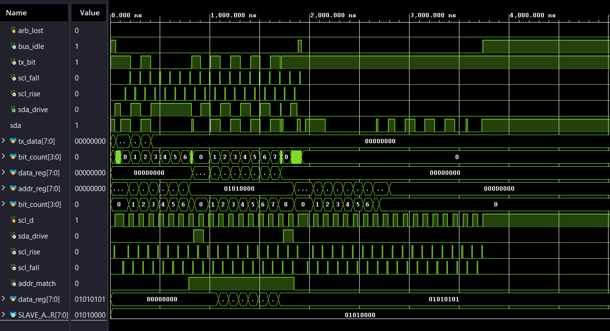
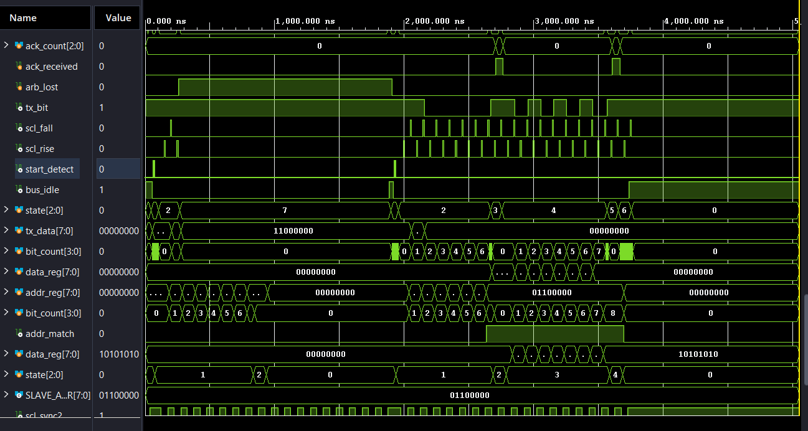
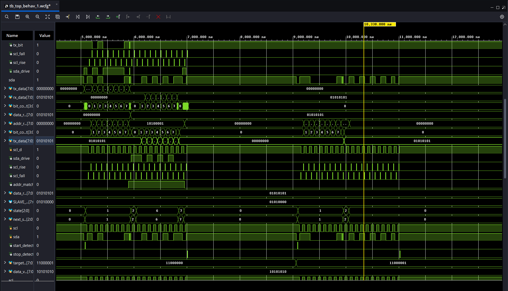
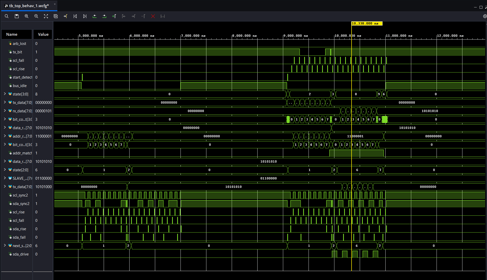

# FPGA I2C Multi-Master Multi-Slave Controller (Verilog)

A Verilog implementation of the I2C protocol supporting:

- Multiple Masters
- Multiple Slaves
- Arbitration between Masters
- Address Acknowledge (ACK)
- Data Acknowledge (ACK)
- Bidirectional Read/Write Transactions
- Open-Drain SDA/SCL Bus Modeling
- Clock Synchronization
- Simulation and Verification in Vivado

This project was developed as part of FPGA and digital design learning to gain a deeper understanding of bus protocols, arbitration mechanisms, finite state machine design, and shared-bus communication.

---

## Features

### Multi-Master Support
- Two independent I2C masters can initiate transactions.
- Arbitration is performed according to the I2C standard.
- A master transmitting a logic '1' while observing a logic '0' on SDA loses arbitration and releases the bus.

### Multi-Slave Support
- Two independent slave devices.
- Address-based slave selection.
- Each slave responds only to its configured address.

### Bidirectional Communication
Supports both:

#### Write Transactions
Master → Slave

- Master sends slave address with R/W = 0
- Slave acknowledges
- Master transmits data byte
- Slave acknowledges receipt

#### Read Transactions
Slave → Master

- Master sends slave address with R/W = 1
- Slave acknowledges
- Slave transmits stored data
- Master receives and acknowledges

### ACK/NACK Handling
- Address ACK
- Data ACK
- Timeout protection using ACK counters

### Bus Arbitration
- Detects arbitration loss during address transmission
- Detects arbitration loss during data transmission
- Losing master releases SDA immediately
- Automatically waits for bus availability before retrying

---

## Design Architecture

### Top Level

```text
                 +-----------+
                 | Master 1  |
                 +-----------+
                       |
                       |
                       +---- SDA/SCL ----+
                                          |
                 +-----------+            |
                 | Master 2  |            |
                 +-----------+            |
                                          |
                 +-----------+            |
                 | Slave 1   |            |
                 +-----------+            |
                                          |
                 +-----------+            |
                 | Slave 2   |            |
                 +-----------+            |
```

---

## Repository Structure

```text
fpga-i2c-multi-master-multi-slave/
│
├── rtl/
│   ├── Master.v
│   ├── Slave.v
│   └── top.v
│
├── tb/
│   └── tb.v
│
├── sim/
│   ├── Waveform_1.png
│   ├── Waveform_2.png
│   ├── Waveform_3.png
│   └── Waveform_4.png
│
├── docs/
│   └── schematic.png
│
└── README.md
```

---

## Master FSM

```text
IDLE
  |
START
  |
SEND_ADDR
  |
ADDR_ACK
  |
+-------------------+
|                   |
v                   v
SEND_DATA      REC_DATA
|                   |
DATA_ACK      MASTER_ACK
|                   |
+---------+---------+
          |
        STOP
```

---

## Slave FSM

```text
IDLE
  |
ADDR_MATCH
  |
ADDR_ACK
  |
+-------------------+
|                   |
v                   v
REC_DATA      SEND_DATA
|                   |
DATA_ACK      WAIT_M_ACK
|                   |
+---------+---------+
          |
         IDLE
```

---

## Read / Write Operation

### Write Sequence

```text
Master
  |
  | START
  |
  | Address + W
  |
Slave ACK
  |
  | Data Byte
  |
Slave ACK
  |
 STOP
```

### Read Sequence

```text
Master
  |
  | START
  |
  | Address + R
  |
Slave ACK
  |
Slave sends Data
  |
Master ACK
  |
 STOP
```

---

## Simulation Results

### Waveform 1
Multi-master arbitration Master-1



---

### Waveform 2
Multi-master arbitration Master-2



---

### Waveform 3
Bidirectional read transaction with slave-1 transmitting data back to the master-1.



---

### Waveform 4
Bidirectional read transaction with slave-2 transmitting data back to the master-2.



---

## Verification Performed

### Address Phase
- Correct address transmission
- Address matching
- ACK generation

### Data Phase
- Write transactions
- Read transactions
- ACK/NACK handling

### Arbitration
- Simultaneous master access
- Arbitration loss detection
- Bus release after arbitration loss
- Retry after bus becomes idle

### Multi-Slave Operation
- Slave 1 communication
- Slave 2 communication
- Independent address matching

---

## Tools Used

- Verilog HDL
- Xilinx Vivado Simulator
- Git
- GitHub

---

## Future Improvements

- Clock stretching support
- Repeated START condition
- Multiple-byte transfers
- FIFO-based buffering
- Wishbone / AXI-Lite interface
- FPGA hardware validation on development boards

---

## Author

Tejasswat Rajindu

B.Tech Electronics and Communication Engineering

Manipal Institute of Technology, Bengaluru