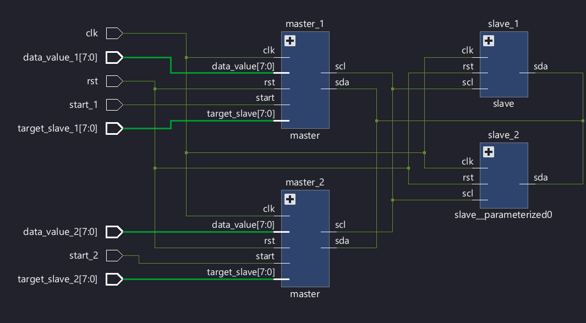

# FPGA I²C Multi-Master Multi-Slave Implementation

A Verilog implementation of the I²C (Inter-Integrated Circuit) protocol featuring multi-master arbitration, multi-slave communication, ACK/NACK handling, start/stop detection, and open-drain bus operation.

## Overview

This project implements the I²C protocol from scratch using Verilog HDL. The design supports communication between multiple masters and multiple slaves connected to a shared open-drain bus. The implementation includes arbitration logic to resolve simultaneous bus access attempts, address matching, acknowledgment handling, and protocol state machines for both master and slave devices.

The project was developed and verified through simulation in Vivado.

---

## Features

- I²C Master Controller
- I²C Slave Controller
- Multi-Master Bus Support
- Multi-Slave Bus Support
- Arbitration Detection and Handling
- ACK/NACK Generation and Reception
- Start Condition Detection
- Stop Condition Detection
- Open-Drain SDA and SCL Modeling
- Parameterizable Slave Addresses
- Functional Simulation and Verification

---

## Project Structure

```text
fpga-i2c-multi-master-multi-slave
│
├── docs
│   └── schematic.png
│
├── rtl
│   ├── Master.v
│   ├── Slave.v
│   └── top.v
│
├── sim
│   ├── Waveform_1.png
│   └── Waveform_2.png
│
├── tb
│   └── tb.v
│
└── README.md
```

---

## Design Architecture

The system consists of:

- Master Controller FSM
- Slave Controller FSM
- Arbitration Logic
- Address Matching Logic
- ACK/NACK Handling
- Shared Open-Drain SDA Bus
- Shared Open-Drain SCL Bus

### Block Diagram



---

## Master FSM

The master controller is responsible for:

1. Generating START conditions
2. Transmitting slave addresses
3. Waiting for acknowledgments
4. Transmitting data bytes
5. Detecting arbitration loss
6. Generating STOP conditions

### Master States

- IDLE
- START
- SEND_ADDR
- ADDR_ACK
- SEND_DATA
- DATA_ACK
- STOP
- WAIT_BUS_FREE

---

## Slave FSM

The slave controller is responsible for:

1. Detecting START conditions
2. Receiving addresses
3. Matching slave addresses
4. Sending ACK responses
5. Receiving data bytes
6. Detecting STOP conditions

### Slave States

- IDLE
- REC_ADDR
- ADDR_ACK
- ACK_WAIT
- REC_DATA
- DATA_ACK

---

## Arbitration

The implementation supports multiple masters sharing the same bus.

When two masters attempt transmission simultaneously:

- SDA is monitored while SCL is high.
- If a master transmits a logic '1' but observes a logic '0' on the bus, arbitration is lost.
- The losing master releases the bus and waits until the bus becomes available again.

This behavior follows the I²C arbitration mechanism.

---

## Simulation Results

### Address Transfer and ACK Reception


### Multi-Master Communication and Arbitration


---

## Verification Scenarios

The following scenarios were verified through simulation:

- Single-master write transaction
- Slave address matching
- ACK generation and reception
- Data transmission
- Multi-master contention
- Arbitration loss detection
- Multi-slave communication
- Open-drain bus behavior

---

## Tools Used

- Verilog HDL
- Xilinx Vivado
- Vivado Simulator

---

## Future Improvements

- Read Transactions
- Repeated Start Support
- Clock Stretching
- Configurable Bus Frequency
- FPGA Hardware Validation
- UVM-Based Verification Environment

---

## Author

Tejasswat Rajindu

B.Tech Electronics and Communication Engineering  
Manipal Institute of Technology, Bengaluru

---

## License

This project is released for educational and learning purposes.